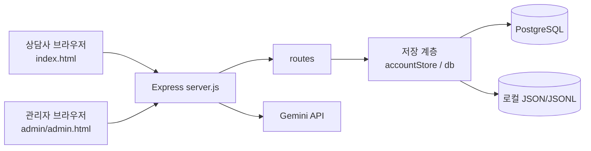
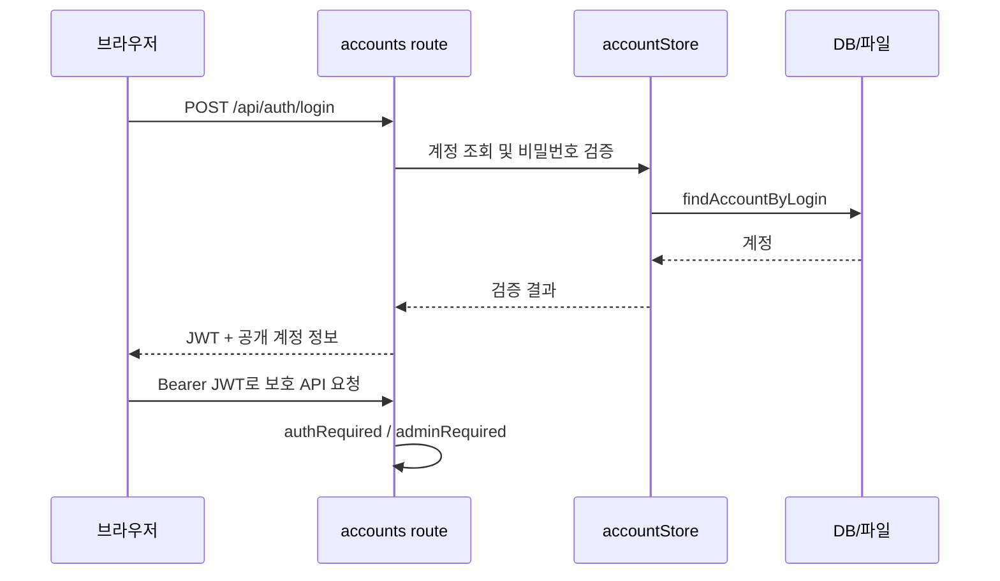
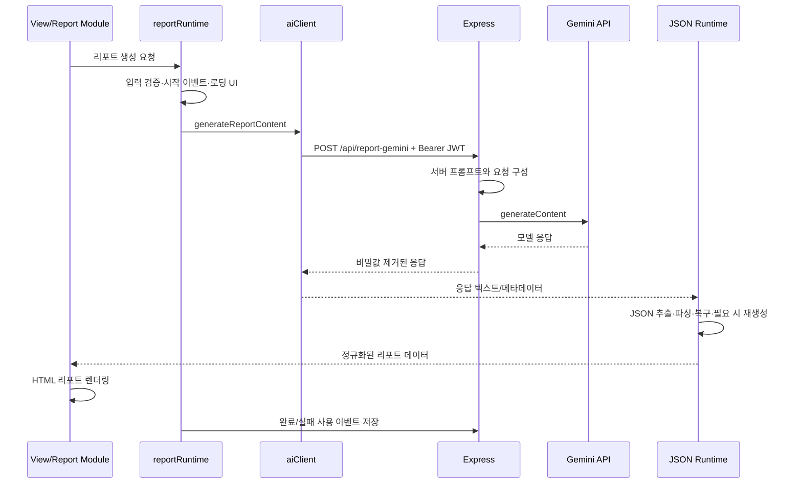

# RE:WORK CENTER 아키텍처

이 문서는 RE:WORK CENTER의 현재 코드 구조와 주요 실행 흐름을 설명합니다. 구현을 변경할 때는 이 문서와 실제 코드를 함께 확인해야 합니다.

## 1. 전체 구조 요약

RE:WORK CENTER는 하나의 Node.js/Express 서버가 두 개의 브라우저 애플리케이션과 API를 함께 제공하는 구조입니다.

- 일반 사용자 앱: 루트의 `index.html`에서 실행되는 상담사 중심 SPA
- 관리자 앱: `admin/admin.html`에서 실행되는 별도 관리자 SPA
- 서버: `server.js`가 정적 파일, 인증 API, 업무 API, Gemini 프록시를 제공
- 데이터 저장: `DATABASE_URL`이 있으면 PostgreSQL을 사용하고, 일부 기능은 로컬 JSON/JSONL 또는 정적 데이터로 대체 가능
- AI 처리: 브라우저가 서버의 인증된 Gemini 프록시를 호출하며 API 키는 서버에만 보관



## 2. 전체 디렉터리 구조

의존성 폴더인 `node_modules`와 Git 내부 파일은 제외했습니다.

```text
jmrework-v5/
├─ index.html                  # 일반 사용자 앱 진입점
├─ privacy.html                # 개인정보 관련 정적 페이지
├─ styles.css                  # 일반 사용자 앱 공통 스타일
├─ server.js                   # Express 서버와 Gemini/로그 API
├─ reportRegistry.js           # 리포트 정의와 메뉴 메타데이터
├─ reportModules.js            # 실행 중 리포트 모듈 저장소
├─ package.json                # 실행·테스트 명령과 의존성
├─ README.md                   # 서비스 및 실행 안내
├─ LOG_SCHEMA.md               # 사용 이벤트 스키마
│
├─ admin/                      # 별도 관리자 SPA
│  ├─ index.html               # admin.html로 이동
│  ├─ admin.html               # 관리자 앱 진입점
│  ├─ css/styles.css
│  ├─ js/
│  │  ├─ state.js              # 관리자 전역 상태
│  │  ├─ utils.js              # 공통 유틸리티
│  │  ├─ ui.js                 # 공통 UI 구성
│  │  ├─ storage.js            # API 호출, 인증 헤더, 캐시
│  │  ├─ accountImport.js      # 계정 일괄 등록 처리
│  │  ├─ app.js                # 관리자 렌더링과 이벤트 연결
│  │  └─ pages/                # 계정·로그인·공지·통계·성공사례 화면
│  └─ LOG_SCHEMA.md
│
├─ js/
│  ├─ core/
│  │  ├─ appCore.js            # 일반 앱 상태, 인증 복원, 공통 데이터 로드
│  │  ├─ usageEvents.js        # 사용 이벤트 모델과 전송
│  │  └─ reportModuleLoader.js # 등록 정보에 따른 리포트 스크립트 로드
│  ├─ views/
│  │  ├─ appRenderer.js        # 현재 상태에 따른 최상위 렌더링
│  │  ├─ authView.js           # 로그인·로그아웃과 인증 화면
│  │  ├─ landingView.js        # 랜딩 페이지
│  │  ├─ shellView.js          # 로그인 후 사이드바와 화면 전환
│  │  ├─ dashboardView.js      # 사용자 대시보드
│  │  ├─ reportWorkspace.js    # 리포트 입력·결과·편집·인쇄 작업공간
│  │  ├─ noticeView.js         # 공지사항
│  │  ├─ aiHubView.js          # AI 허브
│  │  ├─ communityView.js      # 한 줄 메모
│  │  ├─ accountView.js        # 사용자 계정
│  │  └─ statisticsView.js     # 앱 내부 관리자 통계 화면
│  ├─ runtime/
│  │  └─ reportRuntime.js      # 생성 상태, 검증, 오류 분류, 이벤트 기록
│  └─ ai/
│     ├─ aiClient.js           # AI 게이트웨이와 재시도 가능한 요청
│     ├─ geminiJsonParser.js   # Gemini 응답에서 JSON 추출·파싱
│     └─ aiJsonRuntime.js      # JSON 복구, 재생성, 모델 대체 흐름
│
├─ reports/
│  ├─ interestReportModule.js  # 직업선호도검사 리포트
│  ├─ successReportModule.js   # 취업 성공사례 리포트
│  └─ _reportModuleTemplate.js # 신규 리포트 모듈 참고 템플릿
│
├─ routes/
│  ├─ accounts.js              # 로그인, 본인 확인, 계정 관리
│  ├─ notices.js               # 공지 조회와 관리자 CRUD
│  ├─ successCases.js          # 성공사례 검색·관리·일괄 등록
│  ├─ communityPosts.js        # 한 줄 메모 CRUD
│  └─ usageEvents.js           # 사용 이벤트 DB 입출력 도우미
│
├─ lib/
│  ├─ auth.js                  # JWT 인증, 관리자 권한, 요청 제한
│  ├─ passwordPolicy.js        # 비밀번호 검증 규칙
│  ├─ accountStore.js          # 계정 저장소 추상화
│  └─ db.js                    # PostgreSQL 연결과 계정·이벤트 쿼리
│
├─ migrations/                 # PostgreSQL 스키마 변경 이력
├─ prompts/                    # 서버가 읽는 리포트별 Gemini 프롬프트
├─ data/                       # 초기·정적 콘텐츠와 성공사례 대체 데이터
├─ logs/                       # 사용 이벤트 및 Gemini 오류 JSONL
├─ scripts/                    # 관리자 초기화와 데이터 이전 도구
├─ tests/                      # Node 테스트
├─ assets/                     # 이미지 등 정적 자산
└─ docs/                       # 기획·운영 참고 자료
```

## 3. 프런트엔드 진입점과 스크립트 로딩 순서

### 일반 사용자 앱

`index.html`은 번들러 없이 전역 `window` 객체를 공유하는 일반 스크립트를 순서대로 로드합니다. 따라서 아래 순서는 의존성의 일부입니다.

1. `data/contentData.js`: 화면 공통 콘텐츠
2. `reportRegistry.js`: 리포트 종류, 메뉴 순서, 모듈 경로 등록
3. `reportModules.js`: `window.REPORT_MODULES` 레지스트리 생성
4. `js/core/appCore.js`: 전역 상태와 공통 앱 함수 생성
5. `js/core/usageEvents.js`: 사용 이벤트 상수와 기록 함수
6. `js/ai/aiClient.js`: `window.AI_GATEWAY` 구성
7. `js/ai/geminiJsonParser.js`: Gemini JSON 파서
8. `js/ai/aiJsonRuntime.js`: 파싱 복구와 재생성 런타임
9. `js/core/reportModuleLoader.js`: 리포트 정의의 `modulePath`를 동적 로드
10. `data/landingpage.js`: 랜딩 페이지 콘텐츠
11. `js/views/*`: 랜딩, 인증, 공지, AI 허브, 메모, 셸, 대시보드, 리포트, 통계, 계정 화면
12. `js/runtime/reportRuntime.js`: 기존 생성 함수를 감싸 검증·로딩·통계 기록 추가

`reportModuleLoader.js`는 `document.write`로 `reports/*.js`를 삽입합니다. 각 리포트 파일은 로드 시 `window.REPORT_MODULES.register()`를 호출하므로 `reportModules.js`와 `reportRegistry.js`가 먼저 로드되어야 합니다.

### 관리자 앱

`admin/index.html`은 `admin/admin.html`로 이동합니다. `admin/admin.html`의 로딩 순서는 다음과 같습니다.

1. `state.js`
2. `utils.js`
3. `ui.js`
4. 외부 XLSX 라이브러리
5. `storage.js`
6. `accountImport.js`
7. `pages/accounts.js`
8. `pages/login.js`
9. `pages/notices.js`
10. `pages/successCases.js`
11. `pages/statistics.js`
12. `app.js`

`app.js`가 상태에 따라 관리자 화면을 조합하고 `data-action` 이벤트를 각 기능 함수에 연결합니다.

## 4. `views`, `core`, `runtime`, `ai` 모듈의 역할

| 영역 | 책임 | 대표 파일 |
|---|---|---|
| `views` | HTML 문자열 생성, 화면 전환, 사용자 입력과 클릭 처리 | `shellView.js`, `reportWorkspace.js` |
| `core` | 전역 상태, 인증 세션 복원, 공통 데이터 로드, 레지스트리 연결 | `appCore.js`, `usageEvents.js` |
| `runtime` | 리포트 생성 전후의 검증·로딩 UI·오류 분류·통계 기록 | `reportRuntime.js` |
| `ai` | Gemini 요청, 재시도, 응답 JSON 추출, 자동 복구와 모델 대체 | `aiClient.js`, `aiJsonRuntime.js` |

`views`가 사용자의 동작을 받아 리포트 모듈을 호출하고, `runtime`이 그 호출을 감싸 공통 정책을 적용하며, `ai`가 서버 API와 통신합니다. `core`는 이 전 과정에서 공유되는 상태와 데이터를 제공합니다.

## 5. Express 서버와 API 라우트 구조

`server.js`는 `.env`를 읽고 `JWT_SECRET`을 검증한 뒤 Express를 초기화합니다. JSON 요청 크기는 35MB로 제한됩니다.

### 라우터로 분리된 API

| 경로 | 권한 | 역할 |
|---|---|---|
| `POST /api/auth/login` | 공개, 로그인 요청 제한 | 로그인 및 8시간 JWT 발급 |
| `GET /api/auth/me` | 로그인 | 현재 계정 확인 |
| `POST /api/auth/password` | 로그인 | 본인 비밀번호 변경 |
| `/api/accounts*` | 관리자 | 계정 조회·등록·수정·삭제·일괄 등록·비밀번호 변경 |
| `GET /api/notices/public` | 공개 | 공개 공지 조회 |
| `GET /api/notices` | 로그인 | 사용자 공지 조회 |
| `/api/notices/admin`, `/api/notices*` 쓰기 | 관리자 | 공지 관리 |
| `GET /api/success-cases/search` | 로그인 | 성공사례 검색 |
| `/api/success-cases/admin*` | 관리자 | 성공사례·업로드 이력 관리 |
| `/api/community-posts*` | 로그인 | 한 줄 메모 조회·작성·수정·삭제 |

### `server.js`에 직접 정의된 API

| 경로 | 권한 | 역할 |
|---|---|---|
| `POST /api/gemini` | 로그인 + 요청 제한 | 일반 Gemini 요청 프록시 |
| `POST /api/report-gemini` | 로그인 + 요청 제한 | 서버 프롬프트 기반 리포트 요청 |
| `POST /api/usage-events` | 로그인 | 생성 및 AI 사용 이벤트 저장 |
| `GET /api/usage-events` | 관리자 | 통계용 이벤트 조회 |
| `GET /api/gemini-errors` | 관리자 | 최근 Gemini 오류 조회 |

민감한 서버 파일과 `prompts`, `lib`, `routes`, `logs`, `migrations`, `scripts`, `docs` 경로는 정적 제공 전에 차단됩니다. 나머지 공개 파일은 `express.static()`으로 제공합니다.

## 6. 인증 및 권한 처리 흐름

1. 사용자가 로그인 ID와 비밀번호를 `POST /api/auth/login`으로 전송합니다.
2. `routes/accounts.js`가 `accountStore`를 통해 계정을 조회하고 비밀번호 해시를 검증합니다.
3. 계정 상태와 역할이 유효하면 `accountId`, `role`을 담은 8시간 JWT를 발급합니다.
4. 일반 앱과 관리자 앱은 토큰을 `localStorage`의 `REWORK_AUTH_TOKEN`에 저장합니다.
5. 이후 요청은 `Authorization: Bearer <token>` 헤더를 사용합니다.
6. `authRequired`가 `JWT_SECRET`으로 토큰을 검증하고 `req.user`를 구성합니다.
7. 관리자 API는 이어서 `adminRequired`가 정규화된 역할이 `admin`인지 검사합니다.
8. 일반 앱은 `/api/auth/me`로 세션을 복원하고, 관리자 앱은 관리자 역할이 아니면 관리자 화면 진입을 거부합니다.



## 7. PostgreSQL 데이터 접근 구조

`lib/db.js`는 `DATABASE_URL` 존재 여부로 PostgreSQL 사용 여부를 결정합니다. 연결 시 `pg.Pool`을 사용하며 SSL의 인증서 검증은 비활성화되어 있습니다.

- `lib/db.js`: 연결 풀, 공통 `query`, 계정 CRUD, 사용 이벤트 저장
- `lib/accountStore.js`: 계정 기능이 DB 또는 로컬 파일을 사용하도록 분기하는 저장소 계층
- `routes/*.js`: 기능별 SQL 실행 또는 저장소 호출
- `migrations/*.sql`: 테이블과 인덱스의 변경 이력

주요 테이블은 다음과 같습니다.

- `accounts`: 로그인 ID, 비밀번호 해시, 이름, 역할, 지사, 상태
- `account_password_audit_logs`: 비밀번호 변경 감사 기록
- `usage_events`: 리포트 생성과 AI 사용 이벤트
- `gemini_errors`: Gemini 오류용 스키마
- `notices`: 공지사항
- `success_cases`: 취업 성공사례
- `success_case_import_batches`: 성공사례 업로드 이력과 원본 파일 정보
- `community_posts`: 한 줄 메모

DB가 없을 때의 동작은 기능마다 다릅니다.

- 계정: `accountStore`가 로컬 JSON 저장소로 대체
- 한 줄 메모: 로컬 JSON 파일로 대체
- 성공사례 검색: 정적 성공사례 데이터로 대체
- 공지사항: 빈 목록을 반환하며 쓰기는 사용할 수 없음
- 사용 이벤트: JSONL 로그를 기본으로 보존하고 DB가 있으면 함께 저장·병합

## 8. 리포트 모듈 등록·실행 구조

리포트 기능은 정의와 구현을 분리합니다.

1. `reportRegistry.js`가 리포트 ID, 제목, 메뉴 순서, 사용 가능 여부, `modulePath`를 정의합니다.
2. `reportModules.js`가 런타임 모듈 레지스트리 `window.REPORT_MODULES`를 만듭니다.
3. `reportModuleLoader.js`가 각 정의의 `modulePath`를 읽어 스크립트를 로드합니다.
4. `reports/interestReportModule.js`와 `reports/successReportModule.js`가 각 ID로 구현을 등록합니다.
5. `shellView.js`는 `REPORT_REGISTRY.menuItems()`로 메뉴를 만듭니다.
6. `reportWorkspace.js`는 선택된 ID로 모듈을 찾아 `renderForm()`을 호출합니다.
7. 생성 버튼은 모듈의 `validate()`와 `generate()` 또는 공용 생성 함수를 실행합니다.
8. `reportRuntime.js`가 생성 함수를 감싸 로딩 UI, 오류 처리, 성공·실패 이벤트 기록을 공통 적용합니다.

현재 등록된 리포트는 다음 두 종류입니다.

- `interest`: 직업선호도검사 리포트
- `success`: 취업 성공사례 리포트

신규 리포트는 `_reportModuleTemplate.js`를 참고해 레지스트리 정의와 모듈 구현을 함께 추가해야 합니다.

## 9. Gemini 요청과 결과 처리 흐름



세부 책임은 다음과 같습니다.

- 리포트 모듈: 입력값과 보고서별 컨텍스트·스키마 구성
- `aiClient.js`: `/api/report-gemini` 호출, 모델 선택, 네트워크 재시도
- `server.js`: 프롬프트 파일 로드, 허용된 요청 구성, 서버의 API 키로 Gemini 호출
- `geminiJsonParser.js`: 코드 펜스나 부가 문장이 섞인 응답에서 JSON 추출
- `aiJsonRuntime.js`: 파싱 오류 자동 보정, JSON 복구 요청, 전체 재생성, 대체 모델 시도
- `reportRuntime.js`: 오류 유형 정규화, 재시도·복구 정보와 토큰 사용량 기록

Gemini API 키는 브라우저로 전달하지 않습니다. 서버는 상위 API 오류 응답에서 키를 제거한 뒤 클라이언트에 반환하고 오류 로그를 남깁니다.

## 10. 사용자 화면과 관리자 화면의 관계

두 화면은 프런트엔드 코드와 진입점은 분리되어 있지만 같은 서버와 데이터를 사용합니다.

| 구분 | 일반 사용자 앱 | 관리자 앱 |
|---|---|---|
| 진입점 | `/index.html` | `/admin/admin.html` |
| 주요 사용자 | 상담사 | 관리자 |
| 핵심 기능 | 리포트 생성, 공지 조회, 한 줄 메모, 계정 | 계정·공지·성공사례·통계 관리 |
| 상태 관리 | `js/core/appCore.js`의 전역 `state` | `admin/js/state.js`의 전역 `state` |
| 렌더링 | `js/views/appRenderer.js`와 각 view | `admin/js/app.js`와 pages |
| 인증 토큰 | 동일한 `REWORK_AUTH_TOKEN` 키 | 동일한 `REWORK_AUTH_TOKEN` 키 |
| 서버 API | Express `/api/*` | 동일한 Express `/api/*` |

관리자가 등록한 공지는 랜딩 페이지와 로그인한 사용자 공지 화면에 나타납니다. 관리자가 등록한 성공사례는 상담사의 성공사례 검색과 리포트 생성에 사용됩니다. 일반 사용자의 리포트 생성 이벤트와 Gemini 오류는 관리자 통계 화면에서 조회됩니다.

## 11. 주요 데이터 흐름과 파일 간 의존관계

### 화면 상태와 렌더링

```text
appCore.js의 state
  → appRenderer.js의 render()
    → 인증 여부에 따라 landing/auth 또는 shellTemplate 선택
      → shellView.js가 활성 메뉴 결정
        → dashboard / reportWorkspace / notices / aiHub / community / account
```

### 공지사항

```text
관리자 pages/notices.js
  → storage.js의 인증 요청
    → routes/notices.js
      → PostgreSQL notices
        → 일반 앱 appCore.js/loadNotices
          → landingView.js 또는 noticeView.js
```

### 성공사례 리포트

```text
successReportModule.js
  → GET /api/success-cases/search
    → routes/successCases.js
      → PostgreSQL success_cases 또는 정적 data
  → 선택 사례 + 내담자 입력
    → AI_GATEWAY
      → POST /api/report-gemini
        → Gemini
          → JSON 파싱·정규화
            → 상담 리포트 HTML
```

### 사용 통계

```text
reportRuntime.js / usageEvents.js
  → POST /api/usage-events
    → logs/usage-events.jsonl
    → PostgreSQL usage_events(설정된 경우)
      → GET /api/usage-events(관리자)
        → admin/js/pages/statistics.js
```

### 핵심 의존성 규칙

- `views`는 `state`, 공통 유틸리티, 등록된 리포트 모듈에 의존합니다.
- 리포트 모듈은 `REPORT_MODULES`, AI 게이트웨이, JSON 런타임, 공통 상태에 의존합니다.
- 브라우저 코드는 데이터베이스에 직접 접근하지 않고 `/api/*`만 호출합니다.
- 라우트는 `lib/auth.js`, `lib/db.js`, `lib/accountStore.js`를 통해 인증과 저장을 처리합니다.
- 서버만 Gemini API 키와 프롬프트 원본에 접근합니다.
- 관리자 앱과 일반 앱은 서로의 프런트엔드 파일을 직접 호출하지 않고 공통 API와 데이터로 연결됩니다.

## 12. 변경 시 함께 확인할 파일

| 변경 내용 | 함께 확인할 파일 |
|---|---|
| 새 리포트 종류 추가 | `reportRegistry.js`, `reports/`, `reportModules.js`, `reportModuleLoader.js` |
| 사용자 메뉴 추가 | `shellView.js`, `appCore.js`, `appRenderer.js`, 해당 view |
| API 추가 | `server.js` 또는 `routes/`, `lib/auth.js`, 프런트엔드 호출부 |
| DB 컬럼·테이블 변경 | `migrations/`, `lib/db.js`, 관련 route, 관리자 화면 |
| 인증 정책 변경 | `lib/auth.js`, `routes/accounts.js`, 일반·관리자 로그인 코드, 테스트 |
| Gemini 요청 변경 | `prompts/`, `server.js`, `aiClient.js`, 해당 리포트 모듈 |
| 통계 이벤트 변경 | `usageEvents.js`, `reportRuntime.js`, `server.js`, `LOG_SCHEMA.md`, 관리자 통계 |
